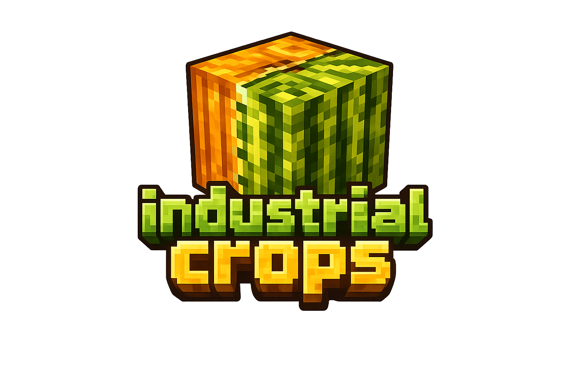

<p align="center">
  
</p>

<h1 align="center">尖端工业化农作物 / Industrial Crops</h1>

<p align="center">
  将工业农业、作物遗传、自动化加工、物流储存与能源设备带入 Minecraft。
  <br>
  Industrial agriculture, crop genetics, automation, logistics and energy systems for Minecraft.
</p>

<p align="center">
  <a href="https://github.com/Yesaz0erq/Industrial_crops/tree/main"></a>
  <a href="https://github.com/Yesaz0erq/Industrial_crops/tree/main"></a>
  <a href="https://github.com/Yesaz0erq/Industrial_crops/tree/forge-1.20.1"></a>
  <a href="LICENSE"></a>
</p>

> 当前分支：**Minecraft 1.20.1 / Forge 47+ / Java 17**。Minecraft 1.21.1 NeoForge 版本请切换到 [`main`](https://github.com/Yesaz0erq/Industrial_crops/tree/main)。

## 简介

**Industrial Crops** 是一个围绕工业农业与自动化生产构建的 Minecraft Mod。玩家可以培育工业作物、分析和改良遗传品质，再使用机器、物流网络与能源系统形成完整生产线。

同一个 JAR 内包含两个相互配合的 Mod：

- **Industrial Crops**（`industrialcrops`）：工业作物、遗传育种、加工机器、物流储存和能源设备。
- **Carrote**（`carrote`）：胡罗贝、悖钢、稳态物质、拟态与复制设备；依赖 Industrial Crops。

## 主要内容

- 🌱 **工业作物与遗传**：工业胡萝卜、马铃薯、小麦、南瓜和西瓜，以及显性/隐性品质分析。
- ⚙️ **自动化加工**：作物转换、压缩、混合、培育、物质数字化和重构等设备。
- 📦 **物流与储存**：基础/强化储存系统、物品管道、网络终端与远程访问。
- ⚡ **能源系统**：FE 发电、储能、电缆以及耗能机器。
- 🧪 **Carrote 科技线**：稳态物质、悖钢锻炉、拟态块与通用复制设备。
- 🔧 **整合支持**：JEI 配方展示、GeckoLib 动画，以及 NeoForge/Forge 双版本维护。

## 支持版本

| Minecraft | 加载器 | Java | Git 分支 | 状态 |
|---|---|---:|---|---|
| 1.21.1 | NeoForge 21.1+ | 21 | [`main`](https://github.com/Yesaz0erq/Industrial_crops/tree/main) | 主要版本 |
| 1.20.1 | Forge 47+ | 17 | [`forge-1.20.1`](https://github.com/Yesaz0erq/Industrial_crops/tree/forge-1.20.1) | 移植版本 |

> 请确保下载的 JAR 与 Minecraft 和加载器版本一致；两个分支的成品不可混用。

## 依赖

- **GeckoLib 4**：必需
- **JEI**：可选，用于配方展示

具体兼容范围请以对应分支的 `gradle.properties` 与模组元数据为准。

## 从源码构建

### NeoForge 1.21.1（`main`）

```powershell
.\gradlew.bat clean build
```

需要 **Java 21**。构建产物：

```text
build/libs/industrial-crops-neoforge-1.0-K1.jar
```

### Forge 1.20.1（`forge-1.20.1`）

```powershell
.\gradlew.bat clean build
```

需要 **Java 17**。构建产物：

```text
build/libs/industrial-crops-forge-1.0-K1.jar
```

## 问题反馈

发现崩溃、兼容问题或功能异常时，请前往 [Issues](https://github.com/Yesaz0erq/Industrial_crops/issues) 提交，并附上：

1. Minecraft、加载器与 Mod 版本；
2. 完整日志或崩溃报告；
3. 可复现步骤和相关截图；
4. 使用的其他核心 Mod、光影或性能 Mod。

## 许可

本项目使用 [MIT License](LICENSE)。
